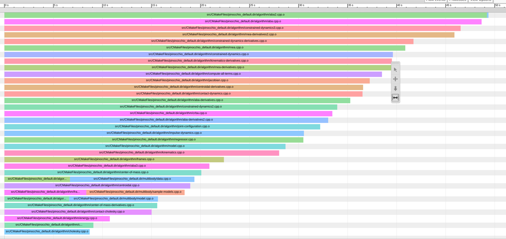

# code-analysis-tools

Guidelines and notes about useful tools to analyze and optimize code.

The idea is to gather some tools that we use to develop high performance code. We should provide information about how to install and use these tools.
Let's begin by collecting all instructions here and later move them to subfolders for each tool if readme gets confusing.

## Compiling

Use **cache** to speed up the compilation. If you compile the same project again and again with small changes, this can save you a lot of time. It is easy to setup. Installation via [conda](https://anaconda.org/conda-forge/ccache) or via [apt-get](https://zoomadmin.com/HowToInstall/UbuntuPackage/ccache). See the manual for the different [run modes](https://manpages.ubuntu.com/manpages/jammy/man1/ccache.1.html). For cmake, you can use a flag

```
cmake .. -DCMAKE_INSTALL_PREFIX=$CONDA_PREFIX -DCMAKE_CXX_COMPILER_LAUNCHER=ccache
```

Use [Clang](https://clang.llvm.org/) & [Ninja](https://github.com/ninja-build/ninja) to speed up the compilation.

Use [**mold**](https://github.com/rui314/mold) to speed up the linking. For cmake, you can add link option in `CMakeLists.txt`

```
add_link_options("-fuse-ld=mold")
```

Tip: To compile a current dev branch like [coal](https://github.com/coal-library/coal) in a clean conda environment containing just the necessary dependencies, install `compilers` and use conda's `cmake` to ensure compatibility and avoid local dependency conflicts..
```
conda create --name ENV_NAME python=3.12
conda activate ENV_NAME
conda install -c conda-forge cmake compilers
conda install coal --only-deps
mkdir build && cd build
cmake .. -DALL_YOUR_FLAGS
make -j8
```

## Debugging C++ code

If you execute compiled experimental code or run a python script that is corresponding c++ bindings [Segmentation Faults](https://en.wikipedia.org/wiki/Segmentation_fault). Specific tools can help you to fix them.  

**FIRST: compile in Debug mode**  

Use either gdb (linux) or lldb (macOS). The commands specified below work for both.

### Usage C++

```bash
# Start debugging session
gdb <your-executable>

# set breakpoints in two different ways, either on specific line for function
b file.cpp:40`
breakpoint set -n functionName

# start
run
```

See [here](https://web.stanford.edu/class/archive/cs/cs107/cs107.1194/resources/gdb) for further details.

### Core dump file analysis

Core dump is another way to debug. First, enable core files

```bash
ulimit -c unlimited
```
Then, view the backtrace in gdb

```bash
gdb path/to/my/executable path/to/coredumpfile
```
See [here](https://askubuntu.com/questions/1349047/where-do-i-find-core-dump-files-and-how-do-i-view-and-analyze-the-backtrace-st) for further details.

### Usage Backward 

[Backward](https://github.com/bombela/backward-cpp) is a beautiful stack trace pretty printer for C++. You need to compile your project with generation of debug symbols enabled, usually `-g` with clang++ and g++. Add the following code to the source file

```c++
#include <backward.hpp>
namespace backward {
  backward::SignalHandling sh;
}
```

### Usage Python bindings

```bash
gdb python
# set breakpoints etc.
run your_script.py
```

Once a program crashes, use `bt` to show the full backtrace.

## Debugging Python code

### Quick-and-dirty one-liner

You can spawn a Python interpreter in-context anywhere in your code:

```python
__import__("IPython").embed()
```

You may add breakpoints in your Python code using:

```python
breakpoint()
```

For a better debugger than the basic `pdb` one, you may install [pdb++](https://github.com/pdbpp/pdbpp) using one of the following commands:

```bash
pip install pdbpp # In a pip environment
conda install -c conda-forge pdbpp # In a Conda environment
```

With `pdb++`, add breakpoints again with `breakpoint()`. You may run `sticky` in the pdb++ environment to toggle a sticky mode (with colored code of the whole function) and start a Python interpreter with the `interact` command.

For debugging code with a graphical interface, check [pudb](https://documen.tician.de/pudb/starting.html) (similar usage).

## Performance analysis with FlameGraph

Checking how much time is spent for every function. Can help you to find the bottleneck in your code.
[FlameGraph](https://github.com/brendangregg/FlameGraph) is a nice visual tool to display your stack trace.

### Install 1

Use [Rust-powered flamegraph](https://github.com/flamegraph-rs/flamegraph) -> **fast**  

```bash
# Install tools needed for analysis like perf
sudo apt-get install linux-tools-common linux-tools-generic linux-tools-`uname -r`

# Install rust on linux or macOS
curl --proto '=https' --tlsv1.3 https://sh.rustup.rs -sSf | sh

# Now you have the rust package managar cargo and you can do
cargo install flamegraph

# Necessary to allow access to cpu (only once)
echo -1 | sudo tee /proc/sys/kernel/perf_event_paranoid
echo 0 | sudo tee /proc/sys/kernel/kptr_restrict

# Command to produce your flamegraph (use -c for custom options for perf)
flamegraph -o sparse_wrapper.svg -v -- example-cpp
```

### Install 2

Use classic perl [flamegraph](https://github.com/brendangregg/FlameGraph)

```bash
# Install tools needed for analysis like perf
sudo apt-get install linux-tools-common linux-tools-generic linux-tools-`uname -r`

# Copy the repo
https://github.com/brendangregg/FlameGraph.git

# Necessary to allow access to cpu (only once)
echo -1 | sudo tee /proc/sys/kernel/perf_event_paranoid
echo 0 | sudo tee /proc/sys/kernel/kptr_restrict

# Run perf on your executable and create output repot in current dir
perf record --call-graph dwarf example-cpp
perf script > perf.out
# You can read the report with cat perf.out ..

cd <cloned-flamegraph-repo>
./stackcollapse-perf.pl <location-of-perf.out> > out.folded
./flamegraph.pl out.folded > file.svg
# Now open the file.svg in your favorite browser in enjoy the interactive mode
```

As the process with the default flamegraph repo is quite a pain, you can write your own script like @ManifoldFR in [proxDDP](https://github.com/Simple-Robotics/proxddp/blob/wj/nnl-rollout/scripts/make_flamegraph.sh).

## Performance analysis with Tracy Profiler 
Tracy is a real time, nanosecond resolution, remote telemetry, hybrid frame and sampling profiler for games and other applications that comes with a nice [documentation](https://github.com/wolfpld/tracy/releases/latest/download/tracy.pdf).
You can checkout the interactive [demo](https://tracy.nereid.pl/).

To use it in your project, you can follow the same steps as in pinocchio or simple:
1. Install it via: `conda install tracy-profiler tracy-profiler-gui -c conda-forge`
2. Include `tracy.cmake` from jrl-cmakemodules in your main CMakeLists file
3. Add tracy as project dependency e.g.
```cmake
if(PROJECT_NAME_BUILD_WITH_TRACY)
  # assume it is installed somewhere
  add_project_dependency(Tracy REQUIRED)
endif(PROJECT_NAME_BUILD_WITH_TRACY)
```
4. In your code: `#include "project_name/tracy.hpp"` and use `PROJECT_NAME_TRACY_ZONE_SCOPED_N("NAME_OF_ZONE")` , where project_name should be replaced by your actual project name.
See [here](https://github.com/jrl-umi3218/jrl-cmakemodules/blob/b5ae8e49306840a50ae9c752c5b4040f892c89d8/tracy.hh.cmake) for all macros.

After specifying the code segments you wish to monitor with Tracy, execute `tracy-profiler` from the command line (ensure your conda environment is active). Run your benchmark files and review the various statistics in the GUI. Note that if you are benchmarking on a remote server, you can connect to it using `ssh user@remote -X` to display the Tracy GUI on your screen.

## Finding memory leaks

[Valgrind](https://valgrind.org/) can automatically detect many memory management and threading bugs.

```
sudo apt install valgrind
# Use valgrind with input to check for mem leak
valgrind --leak-check=yes myprog arg1 arg2
```

Check [here](https://stackoverflow.com/questions/5134891/how-do-i-use-valgrind-to-find-memory-leaks) and [doc](https://valgrind.org/docs/manual/quick-start.html) for further explanation.

[leaks](https://keith.github.io/xcode-man-pages/leaks.1.html) is an alternative tool available on macOS to detect memory leaks:
```
$ leaks -atExit -- myprog

Date/Time:       2024-07-17 17:46:43.948 +0200
Launch Time:     2024-07-17 17:46:42.781 +0200
OS Version:      macOS 14.5 (23F79)
Report Version:  7
Analysis Tool:   Xcode.app/Contents/Developer/usr/bin/leaks
Analysis Tool Version:  Xcode 15.4 (15F31d)

Physical footprint:         4646K
Physical footprint (peak):  4646K
Idle exit:                  untracked
----

leaks Report Version: 4.0, multi-line stacks
Process 56686: 507 nodes malloced for 47 KB
Process 56686: 0 leaks for 0 total leaked bytes.
```
Check out [here](https://developer.apple.com/library/archive/documentation/Performance/Conceptual/ManagingMemory/Articles/FindingLeaks.html) for more information.


### AddressSanitizer

[AddressSanitizer](https://github.com/google/sanitizers/wiki/AddressSanitizer) (aka ASan) is a memory error detector for C/C++. For cmake, you can add link option in `CMakeLists.txt`

```
set(CMAKE_C_FLAGS "${CMAKE_C_FLAGS} -fsanitize=address")
set(CMAKE_CXX_FLAGS "${CMAKE_CXX_FLAGS} -fsanitize=address")
```

## Check Eigen malloc

Use Eigen tools to make sure you are not allocating memory where you do not want to do so -> it is slowing down your program. Check [proxqp](https://github.com/Simple-Robotics/proxsuite/blob/794607d4e35626fc4d5bb704f4f1796347412e71/include/proxsuite/fwd.hpp#L40) or [here](https://stackoverflow.com/questions/33664976/avoiding-eigens-memory-allocation).  

The macros defined in `ProxQP` allow us to do

```cpp
PROXSUITE_EIGEN_MALLOC_NOT_ALLOWED();
output = superfast_function_without_allocations();
PROXSUITE_EIGEN_MALLOC_ALLOWED();
```

and if this code is compiled in `Debug` mode, we will have assertation errors if eigen is allocation memory inside the function.

## Checking for memory alloctions

GUI to check how much memory is allocated in every function when executing a program.  
-> Valgrind + [KCachegrind](https://github.com/KDE/kcachegrind)

### Install

`sudo apt-get install valgrind kcachegrind graphviz`

### Usage

```bash
valgrind --tool=massif --xtree-memory=full <your-executable>
kcachegrind <output-file-of-previous-cmd>
```

## Performance analysis in Python

Python provides a profiler named [cProfile](https://docs.python.org/3/library/profile.html). To profile a script, simply add `-m cProfile -o profile.prof` when running the script, i.e.:

```bash
python -m cProfile -o profile.prof my_script.py --my_args
```

This saves the result in the specified output path (here, `profile.txt`), which you can then visualize with snakeviz: `pip install snakeviz` and then:

```bash
snakeviz profile.prof
```

This opens a browser tab with an interactive visualization of execution times.

## External resources

Some very [useful advices to optimize your C++ code that you should have in mind](https://cpp-optimizations.netlify.app/).

> Narrator: "also quite amusing to read..."

A nice online course to [get started with C++](https://gitlab.inria.fr/formations/cpp/gettingstartedwithmoderncpp/tree/master) explaining most of the basic concepts in c++14/17.

## Debug GitHub CI (SSH)

If your GitHub Actions pipeline fails and you want to inspect the environment directly, you can open an SSH session with [action-tmate](https://github.com/mxschmitt/action-tmate). It launches an interactive terminal in your job, allowing real-time debugging.

1. Add this step at the point where you want the workflow to pause:
  ```yaml
  - name: Start SSH session
    uses: mxschmitt/action-tmate@v3
    with:
      limit-access-to-actor: true
  ```
2. Run the CI
3. An SSH connection command will appear in the workflow log for you to copy and run in your terminal.

**Tip:** the option `continue-on-error: true` can be helpful since you’ll often want to investigate a previous step that failed. It prevents the workflow from stopping immediately on error and allows it to continue to your SSH step so you can connect and debug the environment.

**Note:** `limit-access-to-actor: true` means that only the GitHub user who triggered the workflow can connect — using an SSH key already registered on their GitHub account.

Alternative:
* [lhotari/action-upterm](https://github.com/lhotari/action-upterm) provides similar functionality.
* [debug-via-ssh](https://github.com/marketplace/actions/debug-via-ssh) is **not recommended** since it relies on [ngrok](https://ngrok.com/) which requires credit card information to function.

## Profile C++ compile time of a translation unit

When doing heavy template meta-programming in C++ it can be useful to analyze what part of the code is taking a long time to compile.

[clang](https://clang.llvm.org) allows to profile the compilation time of a translation unit. To activate this function, add the `-ftime-trace` option while building.

In a CMake project, you can do this with the following command line:

```bash
cmake .. -DCMAKE_CXX_FLAGS="-ftime-trace"
```

Each .cpp will then produce a .json file. To find them you can use the following command line:

```bash
find . -iname "*.json"
```

Then, you can open the file with the [Chromium tracing tool](https://www.chromium.org/developers/how-tos/trace-event-profiling-tool/). Open the `about:tracing` URL in Chromium and load the .json. You will have the following display:


### Note for GNU/Linux users

`-ftime-trace` is only available with [clang](https://clang.llvm.org). With [conda](https://docs.conda.io/en/latest/), you can install it with the following command line `conda install clangxx`.

Then, when running CMake **for the first time** use the following command:

```bash
CC=clang CXX=clang++ cmake ..
```


## Profile C++ compile time of a CMake target

When building a CMake target, it's interesting to profile which translation unit took most of the compile time.

Ninja and [ninjatracing](https://github.com/nico/ninjatracing) allow to do visualize the whole target build time.

First clone [ninjatracing](https://github.com/nico/ninjatracing) somewhere.

Then configure your CMake build to use Ninja. Run the following command in a **NEW** build directory:

```bash
cmake .. -GNinja
```

Now, build your project with Ninja:

```bash
ninja
```

The `.ninja_log` file should had been created in the build directory.
You can convert it to a file compatible with the [Chromium tracing tool](https://www.chromium.org/developers/how-tos/trace-event-profiling-tool/).

Run the following command:

```bash
path/to/ninjatracing .ninja_log > trace.json
```

Now, you can visualize it with the [Chromium tracing tool](https://www.chromium.org/developers/how-tos/trace-event-profiling-tool/). Open the `about:tracing` URL in Chromium and load the .json. You will have the following display:




## Launch a process on a particular CPU/CORE/PU

[hwloc tools](https://www.open-mpi.org/projects/hwloc/) allow to study computer and computer cluster topology.

To install `hwloc` on ubuntu, run the following `apt` command:

```bash
sudo apt install hwloc
```

You can show your computer architecture topology with:

```bash
lstopo
```

Also, you can run a process on a particular CPU/CORE/PU with the following command:

```bash
# Run my_exe on processing unit 0
hwloc-bind pu:0 -- my_exe
# Run my_exe on core 2
hwloc-bind pu:2 -- my_exe
```

You can then watch where processes are running with:

```bash
lstopo --ps
```

To go deeper, a [tutorial](https://www.open-mpi.org/projects/hwloc/tutorials/20120702-POA-hwloc-tutorial.html) is available.

## Get stack size

The stack of a program is limited in memory space available. One way to get this value is to run in your favorite terminal:

```bash 
ulimit -s
```

More information on the current configuration can be obtained via:

```bash
ulimit -a
```

## Counting number of lines of codes

It might be useful at some point to count the number of lines of code in a given project.
[Cloc](https://github.com/AlDanial/cloc) is an open-source tool that counts blank lines, comment lines, and physical lines of source code in many programming languages. 

In [Pinocchio](https://github.com/stack-of-tasks/pinocchio), counting the important lines of code can be done using:

```bash
cloc unittest src include examples bindings 
```

which gives:
```
    3149 text files.
    2299 unique files.                                          
     970 files ignored.

github.com/AlDanial/cloc v 2.04  T=0.90 s (2543.7 files/s, 395546.2 lines/s)
--------------------------------------------------------------------------------
Language                      files          blank        comment           code
--------------------------------------------------------------------------------
C/C++ Header                    672          20927          20408         107549
C++                             423          15686           4418          61598
XML                             154            101            120          53449
CMake                           325           2595           4955          18197
Python                          214           4459           2277          15361
make                             13           2073           1463           4100
INI                             100            657              0           4047
Markdown                         71            976             40           2509
Text                             89            231              0           1444
CSS                               4            138             57            549
YAML                             10             48             10            519
Bourne Shell                      4             83            167            444
SVG                               1              1              1            382
Jupyter Notebook                  1              0            655            214
JavaScript                      196            196           3332            196
TeX                               5              0              0            167
reStructuredText                  8            102             83            147
HTML                              4              1             25             92
Objective-C                       1             11             16             92
JSON                              1              0              0             46
Bourne Again Shell                2             14             12             45
awk                               1              0              0             10
--------------------------------------------------------------------------------
SUM:                           2299          48299          38039         271157
--------------------------------------------------------------------------------
```

# Realtime Sanitizer (RTSan)

Allows to detect any non-deterministic behavior in a piece of code, like dynamic allocations, mutex locks, systems calls etc.
It comes with `clang-20`, but with a bit of effort can be user in older versions and GCC with the standalone project (ref below). 
besically all you need to do is add the function attribute `[[clang::nonblocking]]` in your function and compile with `-fsanitize=realtime`.

The `Function Effect Analysis` is a sister project that can detect those in compile-time, where the sanitizers are runtime-only.
To get compile-time analysis, compile with `-Wfunction-effects`.

`a.cpp`
```c++
void f() [[clang::nonblocking]] {
    std::vector<int> v;
    v.push_back(1);
}

int main() {
    f();
    return 0;
}
```
`CMakeLists.txt`
```cmake
cmake_minimum_required(VERSION 3.22)
project(a)
add_executable(a a.cpp)
target_compile_options(a PRIVATE -Werror=function-effects) # compile-time checks
target_compile_options(a PRIVATE -fsanitize=realtime)      # runtime checks
target_link_options(a PRIVATE -fsanitize=realtime)         # runtime checks
```

Try online: https://godbolt.org/z/ozYGc63rE

refs:

LLVM’s Real-Time Safety Revolution:
https://www.youtube.com/watch?v=b_hd5FAv1dw

Standalone RTSan (devmode): https://github.com/realtime-sanitizer/rtsan

Official documentation: 
https://clang.llvm.org/docs/RealtimeSanitizer.html

https://clang.llvm.org/docs/FunctionEffectAnalysis.html


