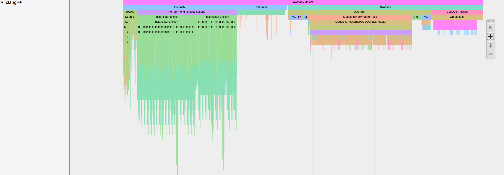

# code-analysis-tools

Guidelines and notes about useful tools to analyze and optimize code.

The idea is to gather some tools that we use to develop high performance code. We should provide information about how to install and use these tools.
Let's begin by collecting all instructions here and later move them to subfolders for each tool if readme gets confusing.

## Compiling

Use **cache** to speed up the compilation. If you compile the same project again and again with small changes, this can save you a lot of time. It is easy to setup. Installation via [conda](https://anaconda.org/conda-forge/ccache) or via [apt-get](https://zoomadmin.com/HowToInstall/UbuntuPackage/ccache). See the manual for the different [run modes](https://manpages.ubuntu.com/manpages/jammy/man1/ccache.1.html). For cmake, you can use a flag

```
cmake .. -DCMAKE_INSTALL_PREFIX=$CONDA_PREFIX -DCMAKE_CXX_COMPILER_LAUNCHER=ccache
```

Use [Clang](https://clang.llvm.org/) & [Ninja](https://github.com/ninja-build/ninja) to speed up the compilation.

Use [**mold**](https://github.com/rui314/mold) to speed up the linking. For cmake, you can add link option in `CMakeLists.txt`

```
add_link_options("-fuse-ld=mold")
```

Tip: To compile a current dev branch like hpp-fcl in a clean conda environment containing just the necessary dependencies, install `compilers` and use conda's `cmake` to ensure compatibility and avoid local dependency conflicts..
```
conda create --name ENV_NAME python=3.12
conda activate ENV_NAME
conda install -c conda-forge cmake compilers
conda install hpp-fcl --only-deps
mkdir build && cd build
cmake .. -DALL_YOUR_FLAGS
make -j8
```

## Debugging C++ code

If you execute compiled experimental code or run a python script that is corresponding c++ bindings [Segmentation Faults](https://en.wikipedia.org/wiki/Segmentation_fault). Specific tools can help you to fix them.  

**FIRST: compile in Debug mode**  

Use either gdb (linux) or lldb (macOS). The commands specified below work for both.

### Usage C++

```bash
# Start debugging session
gdb <your-executable>

# set breakpoints in two different ways, either on specific line for function
b file.cpp:40`
breakpoint set -n functionName

# start
run
```

See [here](https://web.stanford.edu/class/archive/cs/cs107/cs107.1194/resources/gdb) for further details.

### Core dump file analysis

Core dump is another way to debug. First, enable core files

```bash
ulimit -c unlimited
```
Then, view the backtrace in gdb

```bash
gdb path/to/my/executable path/to/coredumpfile
```
See [here](https://askubuntu.com/questions/1349047/where-do-i-find-core-dump-files-and-how-do-i-view-and-analyze-the-backtrace-st) for further details.

### Usage Backward 

[Backward](https://github.com/bombela/backward-cpp) is a beautiful stack trace pretty printer for C++. You need to compile your project with generation of debug symbols enabled, usually `-g` with clang++ and g++. Add the following code to the source file

```c++
#include <backward.hpp>
namespace backward {
  backward::SignalHandling sh;
}
```

### Usage Python bindings

```bash
gdb python
# set breakpoints etc.
run your_script.py
```

Once a program crashes, use `bt` to show the full backtrace.

## Debugging Python code

### Quick-and-dirty one-liner

You can spawn a Python interpreter in-context anywhere in your code:

```python
__import__("IPython").embed()
```

You may add breakpoints in your Python code using:

```python
breakpoint()
```

For a better debugger than the basic `pdb` one, you may install [pdb++](https://github.com/pdbpp/pdbpp) using one of the following commands:

```bash
pip install pdbpp # In a pip environment
conda install -c conda-forge pdbpp # In a Conda environment
```

With `pdb++`, add breakpoints again with `breakpoint()`. You may run `sticky` in the pdb++ environment to toggle a sticky mode (with colored code of the whole function) and start a Python interpreter with the `interact` command.

For debugging code with a graphical interface, check [pudb](https://documen.tician.de/pudb/starting.html) (similar usage).

## Performance analysis

Checking how much time is spent for every function. Can help you to find the bottleneck in your code.
[FlameGraph](https://github.com/brendangregg/FlameGraph) is a nice visual tool to display your stack trace.

### Install 1

Use [Rust-powered flamegraph](https://github.com/flamegraph-rs/flamegraph) -> **fast**  

```bash
# Install tools needed for analysis like perf
sudo apt-get install linux-tools-common linux-tools-generic linux-tools-`uname -r`

# Install rust on linux or macOS
curl --proto '=https' --tlsv1.3 https://sh.rustup.rs -sSf | sh

# Now you have the rust package managar cargo and you can do
cargo install flamegraph

# Necessary to allow access to cpu (only once)
echo -1 | sudo tee /proc/sys/kernel/perf_event_paranoid
echo 0 | sudo tee /proc/sys/kernel/kptr_restrict

# Command to produce your flamegraph (use -c for custom options for perf)
flamegraph -o sparse_wrapper.svg -v -- example-cpp
```

### Install 2

Use classic perl [flamegraph](https://github.com/brendangregg/FlameGraph)

```bash
# Install tools needed for analysis like perf
sudo apt-get install linux-tools-common linux-tools-generic linux-tools-`uname -r`

# Copy the repo
https://github.com/brendangregg/FlameGraph.git

# Necessary to allow access to cpu (only once)
echo -1 | sudo tee /proc/sys/kernel/perf_event_paranoid
echo 0 | sudo tee /proc/sys/kernel/kptr_restrict

# Run perf on your executable and create output repot in current dir
perf record --call-graph dwarf example-cpp
perf script > perf.out
# You can read the report with cat perf.out ..

cd <cloned-flamegraph-repo>
./stackcollapse-perf.pl <location-of-perf.out> > out.folded
./flamegraph.pl out.folded > file.svg
# Now open the file.svg in your favorite browser in enjoy the interactive mode
```

As the process with the default flamegraph repo is quite a pain, you can write your own script like @ManifoldFR in [proxDDP](https://github.com/Simple-Robotics/proxddp/blob/wj/nnl-rollout/scripts/make_flamegraph.sh).

## Finding memory leaks

[Valgrind](https://valgrind.org/) can automatically detect many memory management and threading bugs.

```
sudo apt install valgrind
# Use valgrind with input to check for mem leak
valgrind --leak-check=yes myprog arg1 arg2
```

Check [here](https://stackoverflow.com/questions/5134891/how-do-i-use-valgrind-to-find-memory-leaks) and [doc](https://valgrind.org/docs/manual/quick-start.html) for further explanation.

[leaks](https://keith.github.io/xcode-man-pages/leaks.1.html) is an alternative tool available on macOS to detect memory leaks:
```
$ leaks -atExit -- myprog

Date/Time:       2024-07-17 17:46:43.948 +0200
Launch Time:     2024-07-17 17:46:42.781 +0200
OS Version:      macOS 14.5 (23F79)
Report Version:  7
Analysis Tool:   Xcode.app/Contents/Developer/usr/bin/leaks
Analysis Tool Version:  Xcode 15.4 (15F31d)

Physical footprint:         4646K
Physical footprint (peak):  4646K
Idle exit:                  untracked
----

leaks Report Version: 4.0, multi-line stacks
Process 56686: 507 nodes malloced for 47 KB
Process 56686: 0 leaks for 0 total leaked bytes.
```
Check out [here](https://developer.apple.com/library/archive/documentation/Performance/Conceptual/ManagingMemory/Articles/FindingLeaks.html) for more information.


### AddressSanitizer

[AddressSanitizer](https://github.com/google/sanitizers/wiki/AddressSanitizer) (aka ASan) is a memory error detector for C/C++. For cmake, you can add link option in `CMakeLists.txt`

```
set(CMAKE_C_FLAGS "${CMAKE_C_FLAGS} -fsanitize=address")
set(CMAKE_CXX_FLAGS "${CMAKE_CXX_FLAGS} -fsanitize=address")
```

## Check Eigen malloc

Use Eigen tools to make sure you are not allocating memory where you do not want to do so -> it is slowing down your program. Check [proxqp](https://github.com/Simple-Robotics/proxsuite/blob/794607d4e35626fc4d5bb704f4f1796347412e71/include/proxsuite/fwd.hpp#L40) or [here](https://stackoverflow.com/questions/33664976/avoiding-eigens-memory-allocation).  

The macros defined in `ProxQP` allow us to do

```cpp
PROXSUITE_EIGEN_MALLOC_NOT_ALLOWED();
output = superfast_function_without_allocations();
PROXSUITE_EIGEN_MALLOC_ALLOWED();
```

and if this code is compiled in `Debug` mode, we will have assertation errors if eigen is allocation memory inside the function.

## Checking for memory alloctions

GUI to check how much memory is allocated in every function when executing a program.  
-> Valgrind + [KCachegrind](https://github.com/KDE/kcachegrind)

### Install

`sudo apt-get install valgrind kcachegrind graphviz`

### Usage

```bash
valgrind --tool=massif --xtree-memory=full <your-executable>
kcachegrind <output-file-of-previous-cmd>
```

## Performance analysis in Python

Python provides a profiler named [cProfile](https://docs.python.org/3/library/profile.html). To profile a script, simply add `-m cProfile -o profile.prof` when running the script, i.e.:

```bash
python -m cProfile -o profile.prof my_script.py --my_args
```

This saves the result in the specified output path (here, `profile.txt`), which you can then visualize with snakeviz: `pip install snakeviz` and then:

```bash
snakeviz profile.prof
```

This opens a browser tab with an interactive visualization of execution times.

## External resources

Some very [useful advices to optimize your C++ code that you should have in mind](https://cpp-optimizations.netlify.app/).

> Narrator: "also quite amusing to read..."

A nice online course to [get started with C++](https://gitlab.inria.fr/formations/cpp/gettingstartedwithmoderncpp/tree/master) explaining most of the basic concepts in c++14/17.

## Debug Github CI

If you have a pipeline that is failing, and you would like to check some quick fixes directly on the CI machine [debug-via-ssh](https://github.com/marketplace/actions/debug-via-ssh) is precious:
Sign into your account on [ngrok](https://ngrok.com/) (you can use github) and follow the readme to set it up locally (2mins).
Copy the token you obtained from ngrok into the secrets section of your repo, specify a password for the SSH connection also as token of the repo.
Copy this to your workflow at the position where you would like to stop:

```bash
- name: Start SSH session
  uses: luchihoratiu/debug-via-ssh@main
  with:
    NGROK_AUTH_TOKEN: ${{ secrets.NGROK_AUTH_TOKEN }}
    SSH_PASS: ${{ secrets.SSH_PASS }}
```

Run the CI and follow the output. Note: the option `continue-on-error: True` can be very useful the continue a failing workflow until the point where you ssh to it.

[lhotari/action-upterm](https://github.com/lhotari/action-upterm) and [action-tmate](https://github.com/marketplace/actions/debugging-with-tmate) are also two alternative GitHub actions with similar functionality that can be ran directly without any setup in your CI jobs:

```bash
- name: Start SSH session
  uses: lhotari/action-upterm@v1
```
Consider using the action with `limit-access-to-actor: true`, to limit access to your account.


## Profile C++ compile time

When doing heavy template meta-programming in C++ it can be useful to analyze what part of the code is taking a long time to compile.

[clang](https://clang.llvm.org) allows to profile the compilation time. To activate this function, add the `-ftime-trace` option while building.

In a CMake project, you can do this with the following command line:

```bash
cmake .. -DCMAKE_CXX_FLAGS="-ftime-trace"
```

Each .cpp will then produce a .json file. To find them you can use the following command line:

```bash
find . -iname "*.json"
```

Then, you can open the file with the [Chromium tracing tool](https://www.chromium.org/developers/how-tos/trace-event-profiling-tool/). Open the `about:tracing` URL in Chromium and load the .json. You will have the following display:



### Note for GNU/Linux users

`-ftime-trace` is only available with [clang](https://clang.llvm.org). With [conda](https://docs.conda.io/en/latest/), you can install it with the following command line `conda install clangxx`.

Then, when running CMake **for the first time** use the following command:

```bash
CC=clang CXX=clang++ cmake ..
```
